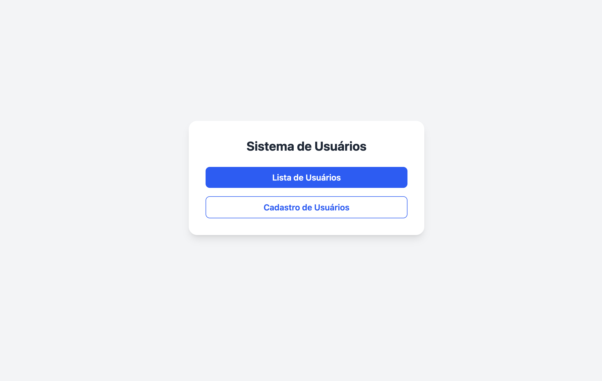
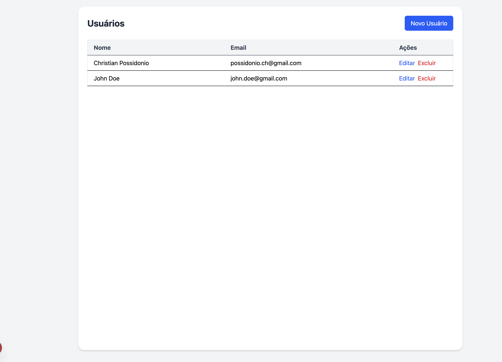

# 🧑‍💻 Users CRUD - Frontend

Este é o frontend de um sistema de usuários desenvolvido com [Next.js](https://nextjs.org), utilizando arquitetura **MVVM**, **React Query**, **Tailwind CSS** e **React Hook Form com Zod** para validações.



---

## 🚀 Tecnologias Utilizadas

- **[Next.js 14](https://nextjs.org)** (App Router)
- **TypeScript**
- **Tailwind CSS**
- **React Query**
- **React Hook Form + Zod**
- **Arquitetura MVVM**

---

## 📁 Estrutura de Pastas

```bash
.
├── app/                        # Rotas do Next.js (App Router)
│   ├── layout.tsx             # Layout raiz
│   └── page.tsx               # Página principal de usuários
├── components/                # Componentes reutilizáveis (botões, tabelas, etc.)
├── models/                    # Services e abstrações de dados
│   └── userService.ts         # Serviço para lidar com a API de usuários
├── viewmodels/                # Lógica de negócio (MVVM)
│   └── useUsersViewModel.ts   # ViewModel dos usuários
├── lib/
│   └── queryClient.tsx        # Configuração do React Query
├── styles/
│   └── globals.css            # Estilos globais (Tailwind)
├── .env                       # Variáveis de ambiente
└── ...

```

🧠 Arquitetura MVVM
	- Model: camada de comunicação com a API (userService.ts)
	- ViewModel: manipula a lógica da view (useUsersViewModel.ts)
	- View: componentes React que exibem os dados

⸻


🔧 Instalação e Execução

1.Clone o repositório:

```bash 
git clone https://github.com/christian-de-ornellas/crud-users-nextjs-mvvm.git
cd crud-users-nextjs-mvvm
```

2. Instale as dependências:
```bash 
npm install
# ou
yarn
```
3. Configure o .env
```bash 
NEXT_PUBLIC_API_URL=http://localhost:3333
```
4. Execute o projeto:
```bash 
npm run dev
# ou
yarn dev
```
Abra http://localhost:3000 no seu navegador.

✅ Funcionalidades
- Listagem de usuários com loading
- Criação, edição e exclusão de usuários
- Confirmação simples no delete com window.confirm()
- Validações de formulário com Zod
- Paginação pronta para integração com backend
- Gerenciamento de cache com React Query
  
📦 Build para Produção

```bash 
npm run build
npm start
```

☁️ Deploy

Pode ser facilmente deployado no Vercel, Netlify ou qualquer plataforma compatível com Next.js.
